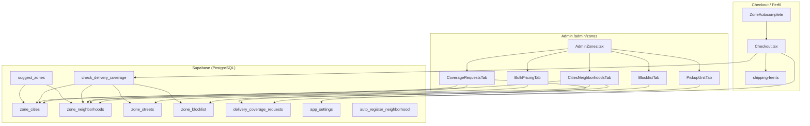
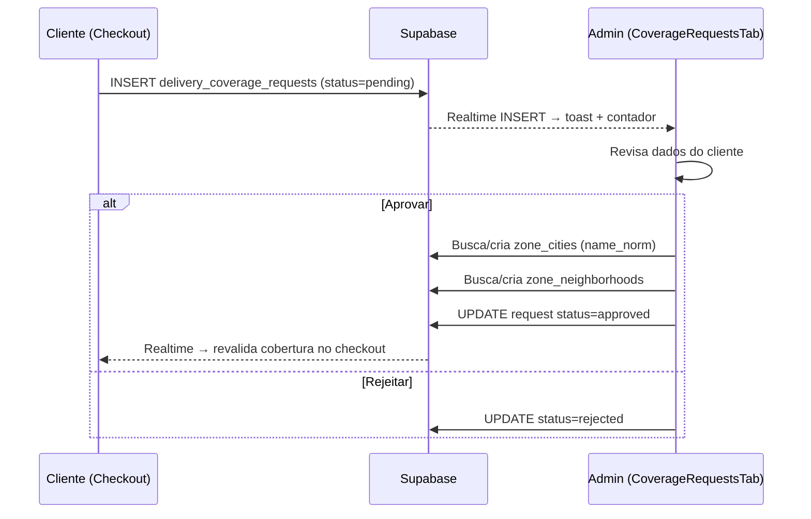

# Sistema de Zonas de Entrega — Documentação Completa

> **Projeto:** order-oven-route (Doceria Dois Sabores)  
> **Rota admin:** `/admin/zonas`  
> **Objetivo deste documento:** explicar toda a lógica do módulo de zonas para replicar em um app de prestação de serviços (ex.: técnico que atende por região, com preço e disponibilidade diferentes).

---

## 1. Visão geral (em linguagem simples)

Imagine que você é uma empresa que **só atende em certas cidades e bairros**. Este sistema faz três coisas principais:

1. **Cadastro geográfico** — o admin cadastra cidades → bairros → ruas (opcional), com preço e tempo estimado.
2. **Regras de bloqueio** — o admin pode “negativar” uma cidade, bairro ou rua (não atendemos ali por enquanto).
3. **Fluxo do cliente** — no checkout, o cliente digita endereço; o sistema verifica se atende, calcula o frete e, se não atender, abre um **chamado** para o admin aprovar a nova região.

O admin gerencia tudo em **5 abas** dentro de `AdminZones`.

---

## 2. Arquitetura do módulo



---

## 3. Inventário de arquivos

| Arquivo | Papel |
|---------|-------|
| `src/pages/admin/AdminZones.tsx` | Página shell com 5 abas e URL `?tab=` |
| `src/components/admin/zones/CitiesNeighborhoodsTab.tsx` | CRUD hierárquico cidade → bairro → rua |
| `src/components/admin/zones/BulkPricingTab.tsx` | Edição em massa de preços/ETA por bairro |
| `src/components/admin/zones/BlocklistTab.tsx` | Lista negra por cidade/bairro/rua |
| `src/components/admin/zones/CoverageRequestsTab.tsx` | Chamados de clientes + aprovação |
| `src/components/admin/zones/ImportNeighborhoodsDialog.tsx` | Importação CSV/XLSX de bairros |
| `src/components/admin/zones/PickupUnitTab.tsx` | Endereço da loja para retirada |
| `src/components/checkout/ZoneAutocomplete.tsx` | Autocomplete de cidade/bairro no checkout |
| `src/lib/shipping-fee.ts` | Cálculo de frete (4 modos) |
| `src/lib/payment-settings.ts` | Config `shipping_mode` em `app_settings` |
| `src/pages/Checkout.tsx` | Verificação de cobertura + abertura de chamado |
| `src/pages/Profile.tsx` | Valida cobertura ao salvar endereço |
| `src/hooks/usePickupUnitConfig.ts` | Hook da unidade de retirada |
| `src/components/admin/CoverageRequestsGlobalNotification.tsx` | Botão flutuante global para admin |
| `src/integrations/supabase/types.ts` | Tipos gerados das tabelas e RPCs |

---

## 4. Modelo de dados (Supabase)

### 4.1 Hierarquia geográfica

```
zone_cities (1)
  └── zone_neighborhoods (N)
        └── zone_streets (N, opcional)
```

#### `zone_cities`

| Coluna | Tipo | Significado |
|--------|------|-------------|
| `id` | uuid | PK |
| `name` | text | Nome exibido ("Belo Horizonte") |
| `name_norm` | text | Nome normalizado (sem acento, minúsculo) — usado para busca |
| `state` | text | UF (ex.: "MG") |
| `active` | boolean | Cidade ativa no sistema |
| `deliver_whole_city` | boolean | Se true, aceita **qualquer** endereço na cidade, mesmo sem bairro cadastrado |
| `city_delivery_fee` | numeric | Frete padrão da cidade (quando `deliver_whole_city`) |
| `city_eta_minutes` | integer | ETA padrão da cidade |

#### `zone_neighborhoods`

| Coluna | Tipo | Significado |
|--------|------|-------------|
| `id` | uuid | PK |
| `city_id` | uuid | FK → `zone_cities` |
| `name` / `name_norm` | text | Nome e versão normalizada |
| `delivery_fee` | numeric | Preço do frete neste bairro (null = usa fallback) |
| `eta_minutes` | integer | Tempo estimado |
| `allow_immediate` | boolean | Permite pedido imediato neste bairro |
| `allow_scheduled` | boolean | Permite encomenda/agendado |
| `active` | boolean | Bairro ativo |

#### `zone_streets` (opcional — granularidade extra)

| Coluna | Tipo | Significado |
|--------|------|-------------|
| `neighborhood_id` | uuid | FK → bairro |
| `name` / `name_norm` | text | Nome da rua |
| `delivery_fee` | numeric | **Sobrescreve** o preço do bairro |
| `active` | boolean | Rua ativa |

> **Normalização:** `name_norm` é preenchido no banco (trigger ou default). No front, a função `normalize()` remove acentos e caracteres especiais para comparar "São Paulo" com "sao paulo".

### 4.2 Blocklist — `zone_blocklist`

| Coluna | Significado |
|--------|-------------|
| `scope` | `'city'` \| `'neighborhood'` \| `'street'` |
| `city_id` / `neighborhood_id` / `street_id` | Referência conforme escopo |
| `reason` | Motivo opcional (ex.: "Obra na via") |

Quando um endereço cai numa negativação, `check_delivery_coverage` retorna `{ blocked: true, reason: "..." }`.

### 4.3 Chamados — `delivery_coverage_requests`

| Coluna | Significado |
|--------|-------------|
| `city_input` / `neighborhood_input` / `street_input` | Texto digitado pelo cliente |
| `customer_name` / `customer_phone` | Contato |
| `full_address` / `cep` | Endereço completo |
| `items_summary` / `total_amount` | Contexto do pedido |
| `status` | `'pending'` \| `'approved'` \| `'rejected'` |
| `resolved_at` | Quando admin resolveu |

### 4.4 Modo legado por CEP (ainda no código, não no admin de zonas)

Tabelas `delivery_zones`, `zone_ceps`, `fee_rules` — usadas quando `shipping_mode === 'zone_based'`.

### 4.5 Configurações — `app_settings`

| Chave | Conteúdo |
|-------|----------|
| `checkout_payment_config` | Modo de frete (`shipping_mode`) |
| `pickup_unit_config` | Endereço da unidade de retirada |

---

## 5. Funções RPC do banco (lógica central)

> As implementações SQL não estão neste repositório (provavelmente aplicadas direto no Supabase), mas o **contrato** está em `types.ts` e o **uso** no front.

### 5.1 `check_delivery_coverage`

**Entrada:**
```typescript
{
  _city: string;
  _neighborhood: string;
  _street: string;
  _order_type: 'immediate' | 'scheduled';
}
```

**Saída (JSON):**
```typescript
{
  covered: boolean;      // Atende neste endereço?
  blocked: boolean;      // Está na blocklist?
  reason?: string;       // 'city_not_found' | 'neighborhood_not_found' | ...
  fee?: number | null;   // Frete calculado
  eta?: number | null;   // Tempo estimado
  city_id?: string;
  neighborhood_id?: string;
  street_id?: string;
}
```

**Ordem lógica inferida (prioridade de preço):**

1. Verifica **blocklist** (rua → bairro → cidade).
2. Busca **cidade** por `name_norm`.
3. Se cidade inativa ou não encontrada → `covered: false`.
4. Se `deliver_whole_city` → coberto (mesmo sem bairro cadastrado), usa `city_delivery_fee`.
5. Busca **bairro** por `name_norm` + `city_id`.
6. Se bairro não existe e cidade **não** entrega inteira → `covered: false`.
7. Verifica `allow_immediate` / `allow_scheduled` conforme `_order_type`.
8. Busca **rua** (se informada) → preço da rua sobrescreve bairro.
9. Preço final: `rua.delivery_fee ?? bairro.delivery_fee ?? city_delivery_fee ?? fallback do app`.

### 5.2 `suggest_zones`

Autocomplete fuzzy (provavelmente usa `pg_trgm`):

```typescript
supabase.rpc('suggest_zones', {
  _query: 'centro',
  _scope: 'city' | 'neighborhood',
  _city_id?: string,  // obrigatório quando scope = neighborhood
});
// Retorna: { id, name, parent_name, similarity }[]
```

### 5.3 `auto_register_neighborhood`

Usado no **Perfil** quando a cidade tem `deliver_whole_city = true` e o cliente salva um bairro novo:

```typescript
supabase.rpc('auto_register_neighborhood', {
  _city_id: string,
  _neighborhood_name: string,
});
// Retorna: uuid do bairro criado
```

> É `SECURITY DEFINER` — clientes não têm INSERT direto em `zone_neighborhoods`.

---

## 6. Modos de frete (`shipping_mode`)

Definidos em `src/lib/payment-settings.ts`, configurados em **Admin → Pagamentos**:

| Modo | Comportamento |
|------|---------------|
| `fixed` | Frete único para todos |
| `free` | Sempre grátis |
| `zone_based` | CEP → faixa em `zone_ceps` → regra em `fee_rules` (legado) |
| `neighborhood_based` | **Usa o módulo de zonas** — RPC `check_delivery_coverage` |

O módulo **Admin/Zonas** é o coração do modo `neighborhood_based`.

### Cálculo no checkout (`shipping-fee.ts`)

```typescript
export function computeCheckoutShippingFee(config, ctx): ShippingFeeResult {
  if (config.shipping_mode === 'free') return { kind: 'ok', fee: 0 };
  if (config.shipping_mode === 'fixed') return { kind: 'ok', fee: config.fixed_delivery_fee };

  if (config.shipping_mode === 'neighborhood_based') {
    const cov = ctx.neighborhoodCoverage;
    if (!cov) return { kind: 'needs_address', fee: null };
    if (cov.blocked) return { kind: 'blocked', fee: null, reason: cov.reason };
    if (!cov.covered) return { kind: 'no_zone', fee: null };
    const fee = cov.fee != null ? Number(cov.fee) : config.default_neighborhood_fee;
    return { kind: 'ok', fee: Math.max(0, fee) };
  }

  // zone_based: CEP + fee_rules...
}
```

---

## 7. Página principal — `AdminZones.tsx`

Shell mínimo: tabs + sincronização com URL.

```tsx
// src/pages/admin/AdminZones.tsx
const VALID_TABS = ['cities', 'bulk', 'blocklist', 'coverage', 'pickup'] as const;

const AdminZones = () => {
  const [searchParams, setSearchParams] = useSearchParams();
  const tabParam = searchParams.get('tab');
  const activeTab = VALID_TABS.includes(tabParam ?? '') ? tabParam! : 'cities';

  const handleTabChange = (value: string) => {
    const next = new URLSearchParams(searchParams);
    if (value === 'cities') next.delete('tab');
    else next.set('tab', value);
    setSearchParams(next, { replace: true });
  };

  return (
    <Tabs value={activeTab} onValueChange={handleTabChange}>
      <TabsTrigger value="cities">Cidades & Bairros</TabsTrigger>
      <TabsTrigger value="bulk">Precificação em Massa</TabsTrigger>
      <TabsTrigger value="blocklist">Negativações</TabsTrigger>
      <TabsTrigger value="coverage">Chamados</TabsTrigger>
      <TabsTrigger value="pickup">Retirada no Local</TabsTrigger>
      {/* TabsContent para cada aba */}
    </Tabs>
  );
};
```

**Por que URL com `?tab=`?** Permite link direto (`/admin/zonas?tab=coverage`) e o botão flutuante de chamados navega para lá.

---

## 8. Aba 1 — Cidades & Bairros

**Arquivo:** `CitiesNeighborhoodsTab.tsx` (~857 linhas)

### O que faz

- Lista cidades em acordeão expansível.
- Dentro de cada cidade: bairros (com busca, seleção múltipla, exclusão em lote).
- Dentro de cada bairro: ruas opcionais.
- CRUD completo via Supabase (`zone_cities`, `zone_neighborhoods`, `zone_streets`).
- Importação em massa de bairros (CSV/XLSX).

### Queries React Query

```typescript
['admin-zone-cities']       → zone_cities
['admin-zone-neighborhoods'] → zone_neighborhoods
['admin-zone-streets']      → zone_streets
```

### Payload de cidade

```typescript
const payload = {
  name: cityForm.name.trim(),
  state: cityForm.state.trim().toUpperCase() || null,
  active: cityForm.active,
  deliver_whole_city: cityForm.deliver_whole_city,
  city_delivery_fee: cityForm.city_delivery_fee === '' ? null : Number(cityForm.city_delivery_fee),
  city_eta_minutes: cityForm.city_eta_minutes === '' ? null : Number(cityForm.city_eta_minutes),
};
```

### Conceito-chave: `deliver_whole_city`

Quando ligado:
- Cliente pode digitar **qualquer bairro** naquela cidade.
- Sistema aceita entrega mesmo se o bairro não estiver cadastrado.
- Usa `city_delivery_fee` e `city_eta_minutes`.
- No autocomplete, mostra aviso amigável: *"Bairro não encontrado, mas fazemos entrega em toda a cidade"*.

### Normalização de busca (front)

```typescript
const normalizeSearch = (s: string) =>
  s.normalize('NFD')
   .replace(/[\u0300-\u036f]/g, '')
   .toLowerCase()
   .replace(/[^a-z0-9]/g, '');
```

---

## 9. Importação de bairros — `ImportNeighborhoodsDialog.tsx`

### Fluxo

1. Admin seleciona arquivo CSV/XLSX.
2. Lê **primeira coluna** (ignora cabeçalho "Bairro"/"Nome").
3. Remove duplicatas via `normalize()`.
4. Compara com `name_norm` existentes no banco.
5. Insere em lotes de **200** registros.
6. Opcionalmente aplica frete/ETA padrão a todos.

```typescript
const toInsert = rows
  .filter((r) => !existingNorm.has(normalize(r.name)))
  .map((r) => ({
    city_id: cityId,
    name: r.name,
    delivery_fee: fee,
    eta_minutes: eta,
    allow_immediate: true,
    allow_scheduled: true,
    active: true,
  }));
```

---

## 10. Aba 2 — Precificação em Massa

**Arquivo:** `BulkPricingTab.tsx`

### Padrão "draft + save"

1. Carrega todos os bairros.
2. Mantém estado local `drafts` por bairro (preço, ETA, flags, `dirty`).
3. Admin edita na tabela ou aplica valor em lote.
4. Só grava no banco ao clicar **Salvar alterações** (`Promise.all` de updates).

### Aplicar valor em lote

```typescript
const applyToAll = () => {
  setDrafts((d) => {
    const next = { ...d };
    for (const n of filtered) {
      next[n.id] = { ...next[n.id], delivery_fee: v, dirty: true };
    }
    return next;
  });
};
```

> **Lição para outro app:** separar edição local de persistência evita centenas de writes acidentais.

---

## 11. Aba 3 — Negativações (Blocklist)

**Arquivo:** `BlocklistTab.tsx`

### Escopos

| Escopo | Efeito |
|--------|--------|
| `city` | Bloqueia cidade inteira |
| `neighborhood` | Bloqueia um bairro |
| `street` | Bloqueia uma rua específica |

```typescript
const payload = { scope, reason: reason.trim() || null };
if (scope === 'city') payload.city_id = cityId;
else if (scope === 'neighborhood') payload.neighborhood_id = neighId;
else payload.street_id = streetId;

await supabase.from('zone_blocklist').insert(payload);
```

---

## 12. Aba 4 — Chamados de Cobertura

**Arquivo:** `CoverageRequestsTab.tsx`

### Fluxo completo



### Aprovação (código essencial)

```typescript
const handleApprove = async () => {
  const cityNorm = normalize(cityName);
  const neighNorm = normalize(neighName);

  // 1) Cidade: encontrar ou criar
  let { data: cityFound } = await supabase
    .from('zone_cities')
    .select('id, active')
    .eq('name_norm', cityNorm)
    .maybeSingle();

  if (!cityFound) {
    const { data: cityIns } = await supabase
      .from('zone_cities')
      .insert({ name: cityName, active: true })
      .select('id')
      .single();
    cityId = cityIns.id;
  }

  // 2) Bairro: encontrar ou criar (com taxa opcional)
  const { data: neighFound } = await supabase
    .from('zone_neighborhoods')
    .select('id')
    .eq('city_id', cityId)
    .eq('name_norm', neighNorm)
    .maybeSingle();

  if (!neighFound) {
    await supabase.from('zone_neighborhoods').insert({
      city_id: cityId,
      name: neighName,
      active: true,
      delivery_fee: feeValue,
      allow_immediate: true,
      allow_scheduled: true,
    });
  }

  // 3) Marcar chamado como approved
  await supabase.from('delivery_coverage_requests').update({
    status: 'approved',
    resolved_at: new Date().toISOString(),
  }).eq('id', selected.id);
};
```

### Realtime

```typescript
supabase.channel('admin-coverage-requests-realtime')
  .on('postgres_changes', { event: 'INSERT', table: 'delivery_coverage_requests' }, ...)
  .subscribe();
```

### Notificação global

`CoverageRequestsGlobalNotification.tsx` — botão flutuante em **qualquer página admin** quando há pendentes.

---

## 13. Aba 5 — Retirada no Local

**Arquivo:** `PickupUnitTab.tsx` + `usePickupUnitConfig.ts`

Não é zona de entrega, mas fica no mesmo menu porque define **onde o cliente retira** o pedido.

Salva JSON em `app_settings` com chave `pickup_unit_config`:

```typescript
interface PickupUnitConfig {
  name: string;
  address: string;
  neighborhood: string;
  city: string;
  state: string;
  cep: string;
  latitude?: number;
  longitude?: number;
}
```

---

## 14. Lado do cliente — Checkout

**Arquivo:** `Checkout.tsx` (trechos relevantes)

### 14.1 Autocomplete de endereço

```tsx
<ZoneAutocomplete scope="city" value={manualCity} onChange={setManualCity} />
<ZoneAutocomplete
  scope="neighborhood"
  value={manualNeighborhood}
  onChange={setManualNeighborhood}
  cityId={matchedCityId}
  cityName={manualCity}
/>
```

### 14.2 Verificação de cobertura

```typescript
const { data: neighborhoodCoverage } = useQuery({
  queryKey: ['neighborhood-coverage', city, neighborhood, street, orderType],
  enabled: shipping_mode === 'neighborhood_based' && Boolean(city && neighborhood),
  queryFn: () => supabase.rpc('check_delivery_coverage', {
    _city: city,
    _neighborhood: neighborhood,
    _street: street,
    _order_type: orderType, // 'immediate' | 'scheduled'
  }),
});
```

### 14.3 Realtime no checkout

Quando admin aprova chamado ou cadastra bairro, o checkout **revalida automaticamente**:

```typescript
supabase.channel('checkout-coverage-realtime')
  .on('postgres_changes', { table: 'delivery_coverage_requests' }, invalidate)
  .on('postgres_changes', { table: 'zone_cities' }, invalidate)
  .on('postgres_changes', { table: 'zone_neighborhoods' }, invalidate)
  .subscribe();
```

### 14.4 Abrir chamado (cliente)

```typescript
await supabase.from('delivery_coverage_requests').insert({
  customer_id: cid,
  customer_name: customerName,
  customer_phone: phoneDigits,
  city_input: city,
  neighborhood_input: neighborhood,
  street_input: street,
  cep: cep,
  full_address: fullLine,
  items_summary: '2x Bolo • 1x Torta',
  total_amount: totalAmount,
  status: 'pending',
});
```

Estados de frete no checkout:

| `shippingState.status` | UI |
|------------------------|-----|
| `ok` | Mostra frete, permite finalizar |
| `no_zone` | "Não atendemos" + botão abrir chamado |
| `blocked` | Região bloqueada |
| `needs_address` | Aguardando cidade/bairro |
| `loading` | Spinner |

---

## 15. Autocomplete — `ZoneAutocomplete.tsx`

### Duas fontes de dados

1. **Sugestões ao digitar** → RPC `suggest_zones` (fuzzy, a partir de 1 caractere).
2. **Lista completa no dialog** → query direta em `zone_cities` / `zone_neighborhoods`.

### Aviso de cobertura

Se o texto digitado **não tem match exato** nas sugestões:

- Cidade: *"Cidade não encontrada... solicite cadastro"*
- Bairro (cidade inteira): *"Bairro não encontrado, mas entregamos em toda a cidade"*
- Bairro (normal): *"Bairro não encontrado... solicite cadastro"*

> O cliente **não é bloqueado** de continuar — pode abrir chamado.

---

## 16. SQL sugerido para replicar (novo projeto)

> Adaptado dos tipos em `types.ts`. Ajuste RLS conforme seu auth.

```sql
-- Extensão para busca fuzzy (suggest_zones)
CREATE EXTENSION IF NOT EXISTS pg_trgm;

CREATE OR REPLACE FUNCTION normalize_zone_text(_input text)
RETURNS text LANGUAGE sql IMMUTABLE AS $$
  SELECT lower(regexp_replace(unaccent(trim(_input)), '[^a-z0-9]', '', 'g'));
$$;

-- Cidades
CREATE TABLE zone_cities (
  id uuid PRIMARY KEY DEFAULT gen_random_uuid(),
  name text NOT NULL,
  name_norm text NOT NULL,
  state text,
  active boolean NOT NULL DEFAULT true,
  deliver_whole_city boolean NOT NULL DEFAULT false,
  city_delivery_fee numeric,
  city_eta_minutes integer,
  created_at timestamptz NOT NULL DEFAULT now(),
  updated_at timestamptz NOT NULL DEFAULT now(),
  UNIQUE (name_norm)
);

-- Bairros
CREATE TABLE zone_neighborhoods (
  id uuid PRIMARY KEY DEFAULT gen_random_uuid(),
  city_id uuid NOT NULL REFERENCES zone_cities(id) ON DELETE CASCADE,
  name text NOT NULL,
  name_norm text NOT NULL,
  delivery_fee numeric,
  eta_minutes integer,
  allow_immediate boolean NOT NULL DEFAULT true,
  allow_scheduled boolean NOT NULL DEFAULT true,
  active boolean NOT NULL DEFAULT true,
  created_at timestamptz NOT NULL DEFAULT now(),
  updated_at timestamptz NOT NULL DEFAULT now(),
  UNIQUE (city_id, name_norm)
);

-- Ruas (opcional)
CREATE TABLE zone_streets (
  id uuid PRIMARY KEY DEFAULT gen_random_uuid(),
  neighborhood_id uuid NOT NULL REFERENCES zone_neighborhoods(id) ON DELETE CASCADE,
  name text NOT NULL,
  name_norm text NOT NULL,
  delivery_fee numeric,
  active boolean NOT NULL DEFAULT true,
  created_at timestamptz NOT NULL DEFAULT now(),
  updated_at timestamptz NOT NULL DEFAULT now(),
  UNIQUE (neighborhood_id, name_norm)
);

-- Blocklist
CREATE TABLE zone_blocklist (
  id uuid PRIMARY KEY DEFAULT gen_random_uuid(),
  scope text NOT NULL CHECK (scope IN ('city', 'neighborhood', 'street')),
  city_id uuid REFERENCES zone_cities(id) ON DELETE CASCADE,
  neighborhood_id uuid REFERENCES zone_neighborhoods(id) ON DELETE CASCADE,
  street_id uuid REFERENCES zone_streets(id) ON DELETE CASCADE,
  reason text,
  created_at timestamptz NOT NULL DEFAULT now()
);

-- Chamados
CREATE TABLE delivery_coverage_requests (
  id uuid PRIMARY KEY DEFAULT gen_random_uuid(),
  customer_id uuid,
  customer_name text,
  customer_phone text,
  city_input text NOT NULL,
  neighborhood_input text NOT NULL,
  street_input text,
  cep text,
  full_address text,
  items_summary text,
  total_amount numeric,
  status text NOT NULL DEFAULT 'pending',
  admin_note text,
  order_id uuid,
  created_at timestamptz NOT NULL DEFAULT now(),
  resolved_at timestamptz
);

-- Trigger para name_norm (exemplo)
CREATE OR REPLACE FUNCTION set_zone_name_norm()
RETURNS trigger LANGUAGE plpgsql AS $$
BEGIN
  NEW.name_norm := normalize_zone_text(NEW.name);
  NEW.updated_at := now();
  RETURN NEW;
END;
$$;

CREATE TRIGGER trg_zone_cities_norm
  BEFORE INSERT OR UPDATE ON zone_cities
  FOR EACH ROW EXECUTE FUNCTION set_zone_name_norm();

-- Repetir triggers para zone_neighborhoods e zone_streets
```

A função `check_delivery_coverage` deve ser implementada como **`SECURITY DEFINER`** para leitura pública segura (clientes consultam, mas não alteram zonas diretamente).

---

## 17. Como adaptar para app de prestação de serviços

### Mapeamento de conceitos

| Doceria (atual) | App de serviços |
|-----------------|-----------------|
| Cidade | Região / município atendido |
| Bairro | Zona de atendimento do técnico |
| Rua | Endereço específico / condomínio |
| `delivery_fee` | Taxa de deslocamento / visita |
| `eta_minutes` | Tempo até chegar |
| `allow_immediate` | Atendimento no mesmo dia |
| `allow_scheduled` | Agendamento futuro |
| Chamado de cobertura | "Quero serviço na minha região" |
| Blocklist | Região temporariamente indisponível |

### Passos recomendados para replicar

1. **Criar tabelas** (seção 16) no Supabase.
2. **Implementar RPCs** `check_delivery_coverage`, `suggest_zones`, `auto_register_neighborhood`.
3. **Copiar/adaptar** os 5 componentes de `src/components/admin/zones/`.
4. **Configurar** `shipping_mode: 'neighborhood_based'` em payment settings.
5. **Integrar** `ZoneAutocomplete` no formulário de endereço do cliente.
6. **No checkout/agendamento**, chamar RPC e bloquear ou oferecer chamado conforme resultado.
7. **Habilitar Realtime** nas tabelas de chamados e zonas.
8. **RLS:** leitura pública de zonas ativas; escrita só admin; chamados: insert para autenticados/anônimos, leitura/update só admin.

### Simplificações possíveis

| Cenário | O que omitir |
|---------|--------------|
| Serviço só por cidade (sem bairro) | `zone_neighborhoods`, `zone_streets` — use só `zone_cities` |
| Preço fixo por região | Aba Bulk Pricing + `default_neighborhood_fee` |
| Sem chamados | Remover `delivery_coverage_requests` e aprovação manual |
| Sem blocklist | Remover `zone_blocklist` |

---

## 18. Diagrama do fluxo do cliente (checkout)

```
Cliente preenche endereço
        │
        ▼
ZoneAutocomplete sugere cidades/bairros (RPC suggest_zones)
        │
        ▼
check_delivery_coverage(cidade, bairro, rua, tipo_pedido)
        │
        ├─ covered + fee → calcula total com taxa de deslocamento
        ├─ blocked → mensagem de região indisponível
        └─ not covered → botão "Solicitar atendimento na minha região"
                │
                ▼
        INSERT delivery_coverage_requests (pending)
                │
                ▼
        Admin aprova → cria zona → Realtime libera checkout
```

---

## 19. Checklist de segurança

- [ ] RLS em todas as tabelas `zone_*`
- [ ] Cliente **nunca** faz UPDATE/DELETE em zonas
- [ ] RPCs sensíveis com `SECURITY DEFINER` + validação interna
- [ ] Chamados: validar telefone antes de insert
- [ ] Admin routes protegidas por role (`isAdmin`)
- [ ] Normalização sempre no banco (não confiar só no front)

---

## 20. Referência rápida — queries usadas

```typescript
// Listar cidades (admin)
supabase.from('zone_cities').select('*').order('name');

// Listar bairros de uma cidade
supabase.from('zone_neighborhoods').select('*').eq('city_id', id);

// Verificar cobertura (cliente)
supabase.rpc('check_delivery_coverage', { _city, _neighborhood, _street, _order_type });

// Autocomplete
supabase.rpc('suggest_zones', { _query, _scope, _city_id });

// Abrir chamado
supabase.from('delivery_coverage_requests').insert({ ... });

// Config frete
supabase.from('app_settings').select('value').eq('key', 'checkout_payment_config');
```

---

## 21. Próximos passos no seu novo app

1. Leia os arquivos listados na seção 3 na ordem: `AdminZones` → tabs → `ZoneAutocomplete` → `Checkout` → `shipping-fee.ts`.
2. Crie as migrations SQL (seção 16) no Supabase do novo projeto.
3. Implemente `check_delivery_coverage` primeiro — é o núcleo de toda a lógica.
4. Copie os componentes admin e adapte labels ("frete" → "taxa de visita", etc.).
5. Teste o ciclo completo: cliente fora da área → chamado → admin aprova → cliente consegue agendar.

---

*Documento gerado para portabilidade do módulo Admin/Zonas — order-oven-route.*
